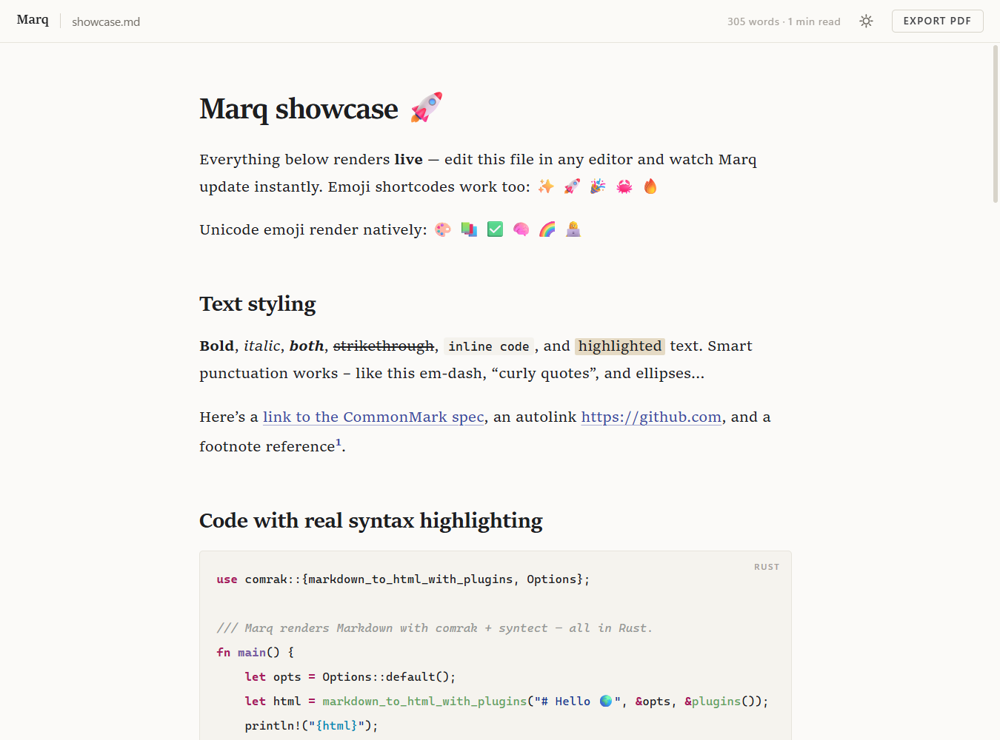
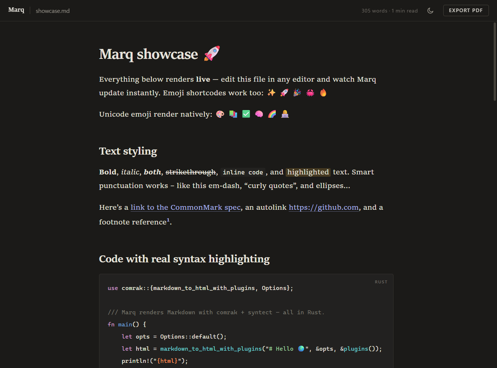

# Marq

**Markdown, beautifully typeset.**

Click a `.md` file — it's on screen instantly, set like a page from a well-made book, 
and one keystroke away from a print-quality PDF.

 

 

### [⬇&nbsp;&nbsp;Download for Windows](https://github.com/HarshalVankudre/marq/releases/latest)

*2.3 MB installer · per-user · no admin required*

 

<table>
  <tr>
    <td></td>
    <td></td>
  </tr>
</table>

 

## A reader, not another editor

Marq does one thing with taste: it turns the plain-text files you live in into documents that feel *finished*. Serif book typography, a calm reading measure, careful hairlines and spacing — in a native window that opens faster than you can blink, because Marq is already there, waiting in your tray.

 

## Features

### 🖋&nbsp; Typeset rendering
Body text set in a real reading serif with a book's line length and rhythm. Headings scale like a title page, horizontal rules become asterisms ( · · · ), tables rule horizontally like print, task lists get crisp custom checkboxes. Light, dark, and follow-the-system themes — each with its own syntax palette.

### ⚡&nbsp; Instant open, always
Marq stays resident in the system tray. Opening a file doesn't launch an app — it lands in the running one, in milliseconds. Close the window and it melts back into the tray; after a few idle minutes it sheds its renderer entirely and parks at roughly **33 MB**. Starts with Windows, so it's ready from the moment you log in.

### 📄&nbsp; One key to PDF
`Ctrl+E` exports the open document as an A4 PDF — embedded fonts, syntax-highlighted code, alert colors, no browser headers or footers. PDFs always export on white, like they'll be read. It's scriptable too: `Marq.exe notes.md --pdf notes.pdf` converts headlessly and exits.

### 🌈&nbsp; Everything Markdown throws at it
Full GitHub-flavored Markdown: tables with alignment, strikethrough, autolinks, footnotes, task lists, definition lists, `
` blocks. All five GitHub alerts (`[!NOTE]` → `[!CAUTION]`) styled as quiet editorial callouts. Emoji shortcodes (`:tada:` → 🎉) and native color emoji. Smart punctuation — real em-dashes, curly quotes. YAML front-matter tucked away automatically.

### 🎨&nbsp; True syntax highlighting
Code blocks are highlighted with Sublime Text's grammar engine — hundreds of languages, resolved in native code before the page even paints. Each block wears a small language label and a hover-to-copy button.

### 👁&nbsp; Live while you write
Save from any editor and Marq re-renders in about 200 ms, scroll position intact. Word count and reading time sit quietly in the toolbar. Local images just work; relative links to other `.md` files open in Marq; web links open in your browser.

### 🔒&nbsp; Safe by construction
Documents render, scripts don't. Raw HTML inside Markdown is sanitized to GitHub's standard — no scripts, no iframes, no surprises from a file you downloaded.

### 🪶&nbsp; No baggage
One native binary built in Rust. No Electron, no bundled browser, no background updater, no telemetry. The installer is 2.3 MB; the app is 7.5 MB.

 

## Keyboard

| Key | Action |
| :-- | :-- |
| `Ctrl` `E` | Export PDF |
| `Ctrl` `O` | Open a document |
| `Ctrl` `+` / `−` / `0` | Text size (also `Ctrl` + wheel) |
| `Ctrl` `P` | Print |
| *drag & drop* | Open any `.md` file |

 

## Make it your default

Run the installer — it registers Marq with Windows and offers to open the right Settings page. Then one click that Windows reserves for you:

> right-click any `.md` file → **Open with** → **Choose another app** → **Marq** → **Always**

From then on, every Markdown file you touch opens typeset.

 

*Built in Rust · rendered by comrak & syntect · © 2026 Harshal Vankudre*

